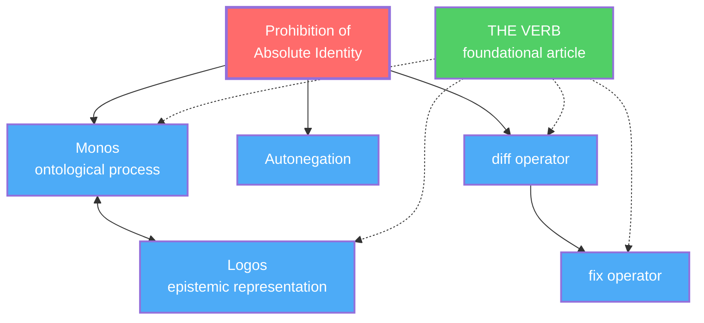
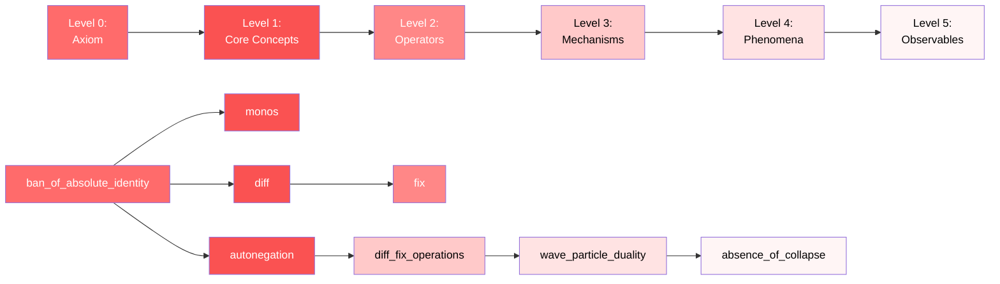
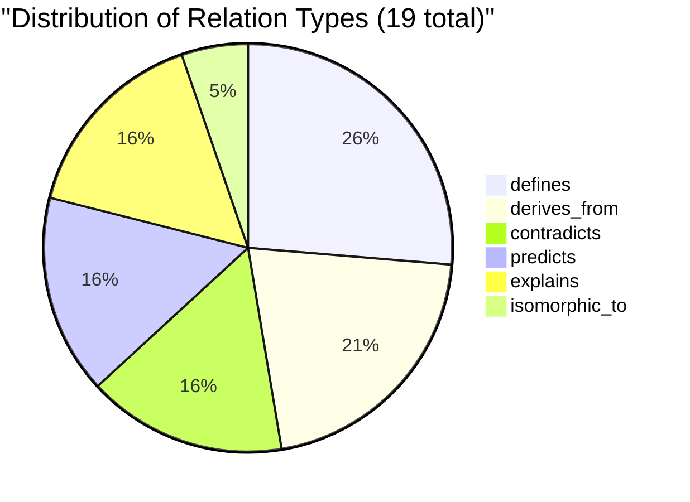
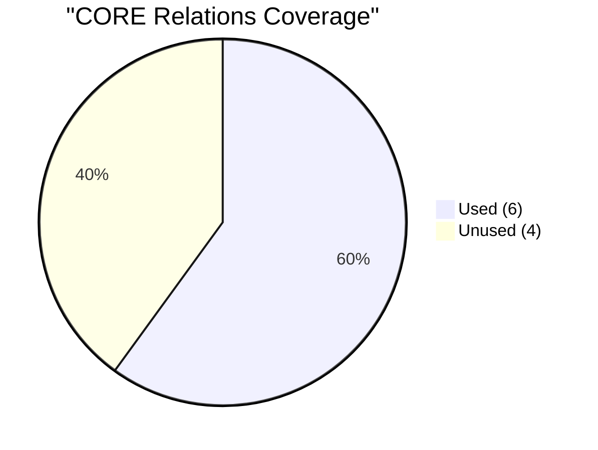

# Knowledge Graph: Semantic Network of Metamonism

## Purpose

This directory contains **automatically generated** machine-readable mappings of all relationships within the Metamonism framework. It serves as the central hub for semantic connections between:

- **Core axioms and definitions** (`CORE/`)
- **Machine-readable article specifications** (`ARTICLES/M/`)
- **Disciplinary models** (`ONTODYNAMICS/`)

**⚠️ CRITICAL: Files in this directory are GENERATED, not authored.**  
Manual editing is prohibited. All changes must occur in source files (`CORE/`, `ARTICLES/M/`, `ONTODYNAMICS/`).

---

## Architecture

KNOWLEDGE_GRAPH is **not an independent ontology** — it is a **projection** of `CORE/` ontology.

**Source of truth (in order):**
1. `CORE/axioms.yaml`
2. `CORE/operators.yaml`
3. `CORE/definitions.yaml`
4. `CORE/relations.yaml` ← defines ALL admissible relation types
5. `ARTICLES/M/*.yaml` ← semantic_relations sections
6. `ONTODYNAMICS/*.yaml` ← derivations and applications

See **[CONTRACT.yaml](CONTRACT.yaml)** for the complete formal specification.

---

## Current Status

**🔧 Phase 1: Specification Complete**

- ✅ `CORE/relations.yaml` — canonical relation types defined
- ✅ `CORE/operators.yaml` — composition constraints defined
- ✅ `CONTRACT.yaml` — formal build specification created
- 🚧 Build pipeline — in development
- 🚧 Graph generation — pending ARTICLES/M population

---

## Files

### Generated Outputs (auto-updated)

- **`global_relations.jsonld`** — Primary semantic graph in JSON-LD format (RDF-compatible)
- **`cross_reference.csv`** — Human-readable table of relationships for review and navigation
- **`visualization/`** — Visual representations of the ontological structure (future)

### Specifications

- **`CONTRACT.yaml`** — Formal specification of graph generation, validation rules, and architectural principles
- **`README.md`** — This file (user-facing overview)

---

## How It Works

### 1. **Authors declare semantic relations in ARTICLES/M**

Each M-version article includes a `semantic_relations` section:

```yaml
# ARTICLES/M/thermodynamics.yaml

metadata:
  title: "Thermodynamics as Dissipative Necessity"
  status: "canonical"

semantic_relations:
  - relation: derives_from
    target: "CORE/axioms.yaml#ban_of_absolute_identity"
    
  - relation: uses_operator
    target: "CORE/operators.yaml#diss"
    
  - relation: explains
    target: "entropy_increase"
```

### 2. **Build process validates and aggregates**

```
Load CORE/relations.yaml (admissible relations)
  ↓
Parse ARTICLES/M/*.yaml (extract semantic_relations)
  ↓
Validate (domain/range, cross-domain restrictions)
  ↓
Emit global_relations.jsonld + cross_reference.csv
```

### 3. **Graph enables advanced capabilities**

- **For AI agents**: Validate articles, discover isomorphisms, verify consistency
- **For researchers**: Navigate dependencies, trace derivations from axioms, find related work
- **For system**: Prevent ontological drift, ensure falsifiability, make ONTODYNAMICS derivable

---

## Validation Rules

All relations must satisfy (see `CONTRACT.yaml` for details):

1. **Relation exists** in `CORE/relations.yaml`
2. **Domain/range types** are valid per relation definition
3. **Cross-domain boundary** — only `maps_to` crosses Monos ↔ Logos
4. **Operator compositions** — validated against `CORE/operators.yaml#composition_constraints`
5. **No self-contradiction** — entities cannot `contradicts` themselves
6. **Transitivity enforcement** — for relations marked `transitive: true`

---

## For Developers

### Adding a new article with semantic relations

1. Create `ARTICLES/M/your_article.yaml`
2. Include required `semantic_relations` section
3. Use only relations from `CORE/relations.yaml`
4. Run validation (when build pipeline is ready)
5. Graph auto-updates on successful validation

### Checking current graph state

```bash
# View all relations
cat global_relations.jsonld

# Search for specific entity
grep "thermodynamics" cross_reference.csv

# Validate manually (when script is ready)
./scripts/validate_knowledge_graph.py
```

---

## Architectural Guarantees

This system ensures:

- **Ontological closure** — All relations derive from CMI structure
- **No hidden ontology** — All entity types and relations explicit in CORE
- **Machine verifiable** — Build pipeline returns PASS/FAIL
- **Falsifiability** — System tracks empirical predictions via `predicts` relation

See **[CONTRACT.yaml](CONTRACT.yaml)** for complete formal specification.

---

## Next Steps

- [ ] Populate `ARTICLES/M/` with semantic_relations
- [ ] Implement build pipeline script
- [ ] Generate initial graph files
- [ ] Integrate into CI/CD for auto-validation
- [ ] Add visualization tools

---

## Questions?

- **For ontological questions**: See `CORE/relations.yaml`
- **For build process**: See `CONTRACT.yaml`
- **For relation semantics**: See `CORE/relations.yaml` (each relation has formal semantics)
- **For validation errors**: See `CONTRACT.yaml#validation_rules`

---

**Last updated:** 2026-01-24  
**Status:** Specification phase complete, awaiting implementation
# KNOWLEDGE_GRAPH Mermaid Diagram
# Paste this into GitHub README.md or any Mermaid-compatible viewer

## Full Graph (all 19 relations)

```mermaid
graph TB
    %% Axiom level
    axiom[ban_of_absolute_identity<br/>AXIOM]
    
    %% Core concepts
    monos[monos<br/>concept]
    logos[logos<br/>concept]
    autoneg[autonegation<br/>mechanism]
    diff[diff<br/>CORE operator]
    fix[fix<br/>CORE operator]
    
    %% Article
    verb[the_verb_article<br/>publication]
    
    %% Derived concepts
    difffix[diff_fix_operations]
    recgrad[recursion_gradient]
    
    %% External theories
    aristotle[substance_ontology<br/>Aristotle]
    hegel[absolute_idea<br/>Hegel]
    ontarg[ontological_argument]
    
    %% Phenomena
    conslaw[conservation_laws<br/>phenomenon]
    waveparticle[wave_particle_duality<br/>phenomenon]
    consemer[consciousness_emergence<br/>phenomenon]
    
    %% Observables
    nowavecolapse[absence_of_wavefunction_collapse<br/>observable]
    consthresh[consciousness_at_threshold<br/>observable]
    nosing[absence_of_singularity<br/>observable]
    
    %% Derives from (blue arrows)
    axiom -->|derives_from| monos
    axiom -->|derives_from| autoneg
    axiom -->|derives_from| diff
    diff -->|derives_from| fix
    
    %% Defines (green arrows)
    verb -.->|defines| diff
    verb -.->|defines| fix
    verb -.->|defines| monos
    verb -.->|defines| logos
    verb -.->|defines| autoneg
    
    %% Isomorphic (purple bidirectional)
    monos <-->|isomorphic_to| logos
    
    %% Contradicts (red bidirectional)
    verb <-.->|contradicts| aristotle
    verb <-.->|contradicts| hegel
    verb <-.->|contradicts| ontarg
    
    %% Predicts (orange arrows)
    verb ==>|predicts| nowavecolapse
    verb ==>|predicts| consthresh
    verb ==>|predicts| nosing
    
    %% Explains (yellow arrows)
    autoneg -->|explains| conslaw
    difffix -->|explains| waveparticle
    recgrad -->|explains| consemer
    
    %% Styling
    classDef axiomStyle fill:#ff6b6b,stroke:#c92a2a,stroke-width:3px,color:#fff
    classDef coreStyle fill:#4dabf7,stroke:#1971c2,stroke-width:2px,color:#fff
    classDef articleStyle fill:#51cf66,stroke:#2f9e44,stroke-width:2px,color:#fff
    classDef externalStyle fill:#ffd43b,stroke:#fab005,stroke-width:2px
    classDef phenomenonStyle fill:#da77f2,stroke:#9c36b5,stroke-width:1px
    classDef observableStyle fill:#ff8787,stroke:#fa5252,stroke-width:2px
    
    class axiom axiomStyle
    class monos,logos,autoneg,diff,fix coreStyle
    class verb articleStyle
    class aristotle,hegel,ontarg externalStyle
    class conslaw,waveparticle,consemer phenomenonStyle
    class nowavecolapse,consthresh,nosing observableStyle
```



## Simplified View (Core Structure Only)



## Derivation Chain (Ontological Depth)



## Relations by Type



## Coverage of CORE/relations.yaml


